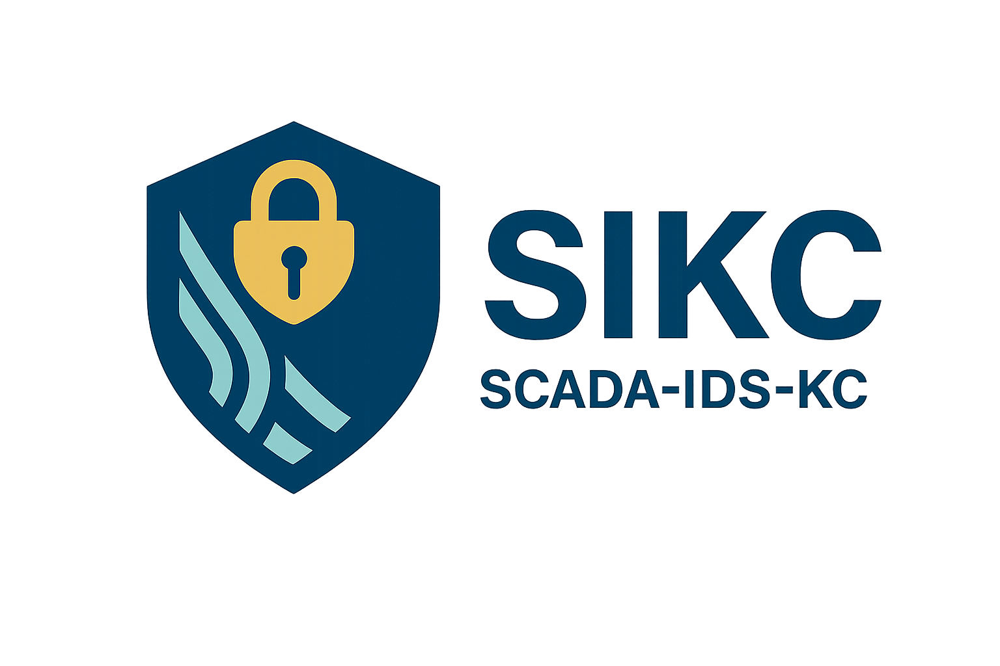

<div align="center">
  
  
  # SCADA-IDS-KC
  
  **A Python-based Network Intrusion Detection System (IDS) with machine learning-based SYN flood detection**
  
  [](https://opensource.org/licenses/MIT)
  [](https://www.python.org/downloads/)
  [](https://github.com/your-repo/SCADA-IDS-KC)
</div>

## Features

- **Real-time packet capture** using Scapy with BPF filtering
- **Machine learning detection** for SYN flood attacks using scikit-learn
- **Cross-platform GUI** built with PyQt6
- **System notifications** with native Windows/Linux support
- **Configurable settings** using Pydantic with YAML configuration
- **Single executable** packaging with PyInstaller
- **Offline installation** support with pre-downloaded dependencies

## Quick Start

### Windows
```powershell
.\build_windows.ps1
```

### Linux
```bash
./build_linux.sh
```

## Requirements

- Python 3.12.2
- Administrator/root privileges for packet capture
- Network interface with promiscuous mode support

## Architecture

```
SCADA-IDS-KC/
├── src/scada_ids/     # Core engine
├── src/ui/            # PyQt6 GUI
├── config/            # Configuration files
├── models/            # ML models
├── packaging/         # Build specifications
└── tests/             # Test suite
```

## Dependencies

| Package | Version | Purpose |
|---------|---------|---------|
| Python | 3.12.2 | Base runtime |
| Scapy | 2.5.0 | Packet capture |
| PyQt6 | 6.7.0 | GUI framework |
| scikit-learn | 1.5.0 | ML inference |
| Pydantic | 2.7.1 | Configuration |
| PyInstaller | 6.6.0 | Executable packaging |

## Network Setup

For switch port monitoring, configure a SPAN session:
```
monitor session 1 source interface Gi0/1 both
monitor session 1 destination interface Gi0/24
```

Connect the SCADA-IDS-KC system to the destination port.

## License

MIT License - see LICENSE file for details.
