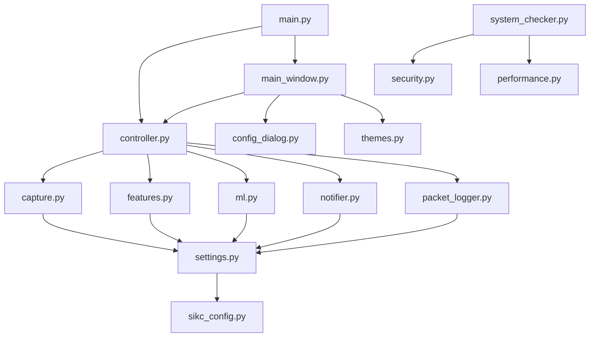

# SCADA-IDS-KC Module Reference

**Version:** 1.0.0  
**Date:** July 21, 2025

---

## 📋 Table of Contents

1. [Module Overview](#module-overview)
2. [Core Modules](#core-modules)
3. [GUI Modules](#gui-modules)
4. [Configuration Modules](#configuration-modules)
5. [Utility Modules](#utility-modules)
6. [Test Modules](#test-modules)
7. [Module Dependencies](#module-dependencies)

---

## 🔍 Module Overview

The SCADA-IDS-KC system is organized into logical modules with clear responsibilities:

```
src/
├── scada_ids/              # Core IDS functionality
│   ├── __init__.py         # Package initialization
│   ├── capture.py          # Network packet capture
│   ├── controller.py       # Main application controller
│   ├── features.py         # Feature extraction engine
│   ├── ml.py              # Machine learning detection
│   ├── notifier.py        # Notification system
│   ├── packet_logger.py   # Packet logging system
│   ├── performance.py     # Performance monitoring
│   ├── security.py        # Security validation
│   ├── settings.py        # Settings management
│   ├── sikc_config.py     # SIKC configuration manager
│   └── system_checker.py  # System requirements checker
└── ui/                    # GUI components
    ├── __init__.py        # UI package initialization
    ├── config_dialog.py   # Configuration dialog
    ├── main_window.py     # Main application window
    ├── requirements_dialog.py # Requirements dialog
    ├── splash_screen.py   # Startup splash screen
    └── themes.py          # Theme management
```

---

## 🔧 Core Modules

### `scada_ids/__init__.py`
**Purpose**: Package initialization and version information.

**Exports**:
- `__version__`: Package version string
- `__author__`: Author information
- `__description__`: Package description

**Example**:
```python
import scada_ids
print(f"SCADA-IDS-KC version: {scada_ids.__version__}")
```

### `scada_ids/capture.py`
**Purpose**: Network packet capture using Scapy with thread-safe implementation.

**Key Classes**:
- `PacketSniffer`: Main packet capture class

**Key Functions**:
- `get_network_interfaces()`: Get available interfaces
- `validate_interface()`: Validate interface availability

**Dependencies**:
- `scapy`: Network packet capture
- `threading`: Thread safety
- `queue`: Packet buffering

**Thread Safety**: ✅ Full thread safety with RLock

**Example Usage**:
```python
from scada_ids.capture import PacketSniffer

def packet_handler(packet_info):
    print(f"Captured packet from {packet_info['src_ip']}")

sniffer = PacketSniffer(packet_callback=packet_handler)
sniffer.start_capture("eth0")
```

### `scada_ids/controller.py`
**Purpose**: Central coordinator orchestrating all IDS components.

**Key Classes**:
- `IDSController`: Main application controller

**Key Functions**:
- `get_controller()`: Get singleton controller instance

**Dependencies**:
- `scada_ids.capture`: Packet capture
- `scada_ids.features`: Feature extraction
- `scada_ids.ml`: ML detection
- `scada_ids.notifier`: Notifications
- `scada_ids.packet_logger`: Logging

**Thread Safety**: ✅ Full thread safety with RLock

**Design Pattern**: Singleton with lazy initialization

**Example Usage**:
```python
from scada_ids.controller import get_controller

controller = get_controller()
controller.start("eth0")
stats = controller.get_statistics()
controller.stop()
```

### `scada_ids/features.py`
**Purpose**: Extract network features from packets using sliding window counters.

**Key Classes**:
- `FeatureExtractor`: Feature extraction engine
- `PacketFeatures`: Feature data container

**Key Functions**:
- `extract_features()`: Extract 19 features from packet
- `get_feature_names()`: Get ordered feature names

**Feature Categories**:
1. **Global Rates**: SYN rate, packet rate, byte rate
2. **Source Rates**: Per-source IP statistics
3. **Destination Rates**: Per-destination IP statistics
4. **Port Analysis**: Unique ports and scanning detection
5. **Packet Properties**: Size, ports, flags
6. **Flag Analysis**: TCP flag presence
7. **Derived Features**: Ratios and computed values

**Memory Management**: Automatic cleanup with sliding windows

**Example Usage**:
```python
from scada_ids.features import FeatureExtractor

extractor = FeatureExtractor()
features = extractor.extract_features(packet_info)
print(f"Extracted {len(features)} features")
```

### `scada_ids/ml.py`
**Purpose**: Machine learning-based threat detection with security validation.

**Key Classes**:
- `MLDetector`: Main ML detection engine
- `DummyClassifier`: Fallback classifier for testing
- `DummyScaler`: Fallback scaler for testing

**Key Functions**:
- `get_detector()`: Get singleton detector instance

**Supported Models**:
- RandomForestClassifier (primary)
- Any scikit-learn classifier (extensible)

**Security Features**:
- Input bounds checking
- Model file size limits
- Hash verification
- Adversarial input protection

**Example Usage**:
```python
from scada_ids.ml import get_detector

detector = get_detector()
if detector.is_model_loaded():
    probability, is_threat = detector.predict(features)
```

### `scada_ids/notifier.py`
**Purpose**: Cross-platform notification system for security alerts.

**Key Classes**:
- `NotificationManager`: Main notification system

**Key Functions**:
- `get_notifier()`: Get singleton notifier instance

**Platform Support**:
- Windows: win10toast (primary), plyer (fallback)
- Linux: plyer with libnotify
- macOS: plyer with native notifications
- System tray: Always available

**Example Usage**:
```python
from scada_ids.notifier import get_notifier

notifier = get_notifier()
notifier.send_notification("Alert", "Threat detected", "critical")
```

### `scada_ids/packet_logger.py`
**Purpose**: Comprehensive logging of packet capture and ML analysis events.

**Key Classes**:
- `PacketLogger`: JSON-based logging system

**Log Components**:
- Packet capture events
- Feature extraction results
- ML analysis outcomes
- Performance metrics
- System events

**Log Format**: JSON with millisecond timestamps

**Example Usage**:
```python
from scada_ids.packet_logger import PacketLogger

logger = PacketLogger(settings)
logger.log_packet_capture(packet_info)
logger.log_ml_analysis(packet_id, features, ml_result, processing_time)
```

### `scada_ids/settings.py`
**Purpose**: Centralized configuration management with SIKC.cfg integration.

**Key Classes**:
- `AppSettings`: Main settings container
- `NetworkSettings`: Network configuration
- `DetectionSettings`: ML detection settings
- `NotificationSettings`: Alert configuration
- `LoggingSettings`: Log configuration
- `GUISettings`: Interface settings

**Key Functions**:
- `get_settings()`: Get singleton settings instance
- `reload_settings()`: Reload from file
- `get_sikc_value()`: Get SIKC configuration value
- `set_sikc_value()`: Set SIKC configuration value

**Configuration Sources**:
1. SIKC.cfg (primary)
2. YAML files (secondary)
3. Environment variables (override)
4. Command line arguments (override)

**Example Usage**:
```python
from scada_ids.settings import get_settings, get_sikc_value

settings = get_settings()
threshold = settings.detection.prob_threshold

# Direct SIKC access
value = get_sikc_value('detection', 'prob_threshold', 0.05)
```

---

## 🖥️ GUI Modules

### `ui/__init__.py`
**Purpose**: UI package initialization and common utilities.

**Exports**:
- Common UI constants
- Shared utility functions
- Icon and resource paths

### `ui/main_window.py`
**Purpose**: Primary GUI interface with real-time monitoring dashboard.

**Key Classes**:
- `MainWindow`: Main application window (QMainWindow)
- `IDSWorkerThread`: Background processing thread (QThread)

**UI Components**:
- Header panel with system status
- Tabbed interface (Monitoring, ML Models, Diagnostics)
- Control panel with start/stop buttons
- Real-time statistics dashboard
- Activity log with filtering
- System tray integration

**PyQt6 Integration**:
- Signal/slot communication
- Thread-safe GUI updates
- Custom widgets and layouts
- Theme support

**Example Usage**:
```python
from ui.main_window import MainWindow
from PyQt6.QtWidgets import QApplication

app = QApplication(sys.argv)
window = MainWindow()
window.show()
app.exec()
```

### `ui/config_dialog.py`
**Purpose**: Comprehensive configuration management interface.

**Key Classes**:
- `ConfigurationDialog`: Main configuration dialog (QDialog)
- `ConfigSection`: Individual section widget

**Features**:
- Dynamic tab generation from SIKC sections
- Input validation and type conversion
- Real-time change tracking
- Import/export functionality
- Backup and restore capabilities

**Example Usage**:
```python
from ui.config_dialog import ConfigurationDialog

dialog = ConfigurationDialog(parent_window)
if dialog.exec() == QDialog.DialogCode.Accepted:
    print("Configuration saved")
```

### `ui/themes.py`
**Purpose**: Application theming and styling system.

**Key Classes**:
- `ThemeManager`: Theme management system (QObject)

**Available Themes**:
- Light: Professional light theme
- Dark: Modern dark theme

**Features**:
- Dynamic theme switching
- Persistent theme preferences
- Custom stylesheets
- Color palette management

**Example Usage**:
```python
from ui.themes import get_theme_manager

theme_manager = get_theme_manager()
theme_manager.apply_theme("dark")
```

### `ui/splash_screen.py`
**Purpose**: Professional startup screen with progress indication.

**Key Classes**:
- `SplashScreen`: Startup splash screen (QSplashScreen)

**Features**:
- Logo display with fallback
- Progress message updates
- Auto-close timer
- Smooth transitions

### `ui/requirements_dialog.py`
**Purpose**: Interactive dialog for handling missing system requirements.

**Key Classes**:
- `RequirementsDialog`: Requirements checking dialog

**Features**:
- Detailed requirement status
- Installation guidance
- Platform-specific instructions
- Option to continue with limitations

---

## ⚙️ Configuration Modules

### `scada_ids/sikc_config.py`
**Purpose**: Advanced SIKC.cfg configuration management.

**Key Classes**:
- `SIKCConfig`: SIKC configuration manager

**Features**:
- Schema-based validation
- Backup and restore
- Auto-reload on changes
- Type conversion
- Error reporting

**Configuration Schema**:
```python
SCHEMA = {
    "network": {
        "interface": {"type": str, "default": ""},
        "bpf_filter": {"type": str, "default": "tcp and tcp[13]=2"}
    },
    "detection": {
        "prob_threshold": {"type": float, "min": 0.0, "max": 1.0}
    }
}
```

### `scada_ids/config_validator.py`
**Purpose**: Configuration validation with detailed error reporting.

**Key Classes**:
- `ConfigValidator`: Schema-based validator

**Validation Types**:
- Type checking
- Range validation
- Pattern matching
- Cross-field validation
- Custom rules

---

## 🛠️ Utility Modules

### `scada_ids/security.py`
**Purpose**: Security validation and input sanitization.

**Key Functions**:
- `validate_network_interface()`: Interface name validation
- `sanitize_log_input()`: Log injection prevention
- `check_file_permissions()`: File security checks
- `validate_ip_address()`: IP address validation

### `scada_ids/performance.py`
**Purpose**: System performance monitoring and optimization.

**Key Classes**:
- `PerformanceMonitor`: Real-time performance tracking

**Monitored Metrics**:
- CPU usage per component
- Memory consumption
- Packet processing latency
- Queue sizes and throughput
- Error rates and recovery

### `scada_ids/system_checker.py`
**Purpose**: Comprehensive system requirements validation.

**Key Functions**:
- `check_system_requirements()`: Full system check
- `check_network_capabilities()`: Network capture validation
- `check_ml_dependencies()`: ML library validation
- `check_gui_dependencies()`: GUI framework validation

---

## 🧪 Test Modules

### Test Structure
```
tests/
├── __init__.py                    # Test package init
├── conftest.py                   # Pytest configuration
├── test_capture.py               # Packet capture tests
├── test_controller.py            # Controller tests
├── test_features.py              # Feature extraction tests
├── test_ml.py                    # ML detection tests
├── test_settings.py              # Configuration tests
├── test_integration.py           # Integration tests
├── test_performance.py           # Performance tests
├── test_security.py              # Security tests
├── test_gui_functionality.py     # GUI tests
└── validate_build.py             # Build validation
```

### Test Categories

1. **Unit Tests**: Individual component testing
2. **Integration Tests**: Component interaction testing
3. **Performance Tests**: Throughput and latency testing
4. **Security Tests**: Input validation and security testing
5. **GUI Tests**: User interface functionality testing
6. **Build Tests**: Executable validation testing

---

## 🔗 Module Dependencies

### Dependency Graph



### External Dependencies

#### Core Dependencies
- **Python 3.8+**: Runtime environment
- **scapy**: Network packet capture
- **scikit-learn**: Machine learning models
- **joblib**: Model serialization
- **pydantic**: Data validation
- **PyYAML**: Configuration parsing

#### GUI Dependencies
- **PyQt6**: GUI framework
- **PyQt6.QtCore**: Core Qt functionality
- **PyQt6.QtWidgets**: UI widgets
- **PyQt6.QtGui**: Graphics and styling

#### Platform Dependencies
- **Windows**: Npcap/WinPcap, win10toast
- **Linux**: libpcap, libnotify
- **macOS**: libpcap, native notifications

#### Optional Dependencies
- **numpy**: Numerical computations
- **pandas**: Data analysis
- **plyer**: Cross-platform notifications

### Import Patterns

#### Singleton Pattern
```python
# Used for global instances
from scada_ids.controller import get_controller
from scada_ids.ml import get_detector
from scada_ids.settings import get_settings
```

#### Direct Import
```python
# Used for classes and functions
from scada_ids.capture import PacketSniffer
from scada_ids.features import FeatureExtractor
from ui.main_window import MainWindow
```

#### Conditional Import
```python
# Used for optional dependencies
try:
    import win10toast
    TOAST_AVAILABLE = True
except ImportError:
    TOAST_AVAILABLE = False
```

---

**For detailed implementation information, refer to the individual module source files and their comprehensive docstrings.**
