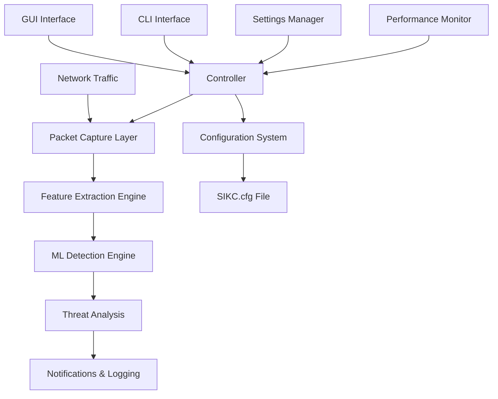

# SCADA-IDS-KC Architecture Overview

**Version:** 1.0.0  
**Date:** July 21, 2025  
**Purpose:** Comprehensive architectural explanation for AI systems and developers

---

## 🔍 **Root Cause Analysis: Interface Access Error**

The error you're seeing is a **Windows network adapter access issue**, not a problem with the application logic. Here's what's happening:

### **Error Breakdown:**
- **Error Code 123**: "The filename, directory name, or volume label syntax is incorrect"
- **All interface variants fail**: Original GUID, rpcap:// prefix, and no-braces format
- **Root Cause**: **Npcap/WinPcap driver issue** or **insufficient privileges**

### **Why This Happens:**
1. **Npcap Not Properly Installed**: The network packet capture driver isn't working
2. **Administrator Privileges Required**: Packet capture requires elevated permissions
3. **Interface State Issues**: Network adapters may be disabled or in an inaccessible state
4. **Driver Conflicts**: Multiple packet capture drivers conflicting

### **Solutions:**
1. **Run as Administrator**: `Right-click → Run as Administrator`
2. **Reinstall Npcap**: Download from https://npcap.com/
3. **Check Network Adapters**: Ensure interfaces are enabled in Device Manager

---

## 🏗️ **SCADA-IDS-KC Architecture Overview**

Here's a comprehensive architectural explanation of how the SCADA-IDS-KC Network Intrusion Detection System works:

### **🎯 System Purpose**
SCADA-IDS-KC is a **real-time network intrusion detection system** specifically designed for SCADA (Supervisory Control and Data Acquisition) environments. It uses **machine learning** to detect network-based attacks, particularly **SYN flood attacks** and other TCP-based threats.

---

## **📐 High-Level Architecture**



---

## **🔧 Core Components Architecture**

### **1. Entry Point & Interface Layer**
- **`main.py`**: Primary application entry point supporting both CLI and GUI modes
- **CLI Mode**: Command-line interface for automated/scripted operations
- **GUI Mode**: PyQt6-based graphical interface for interactive monitoring
- **Dual-mode design**: Same core engine, different interfaces

### **2. Central Controller (`controller.py`)**
**Role**: **Orchestration Hub** - coordinates all system components
```python
# Thread-safe singleton pattern
controller = IDSController()
controller.start(interface="eth0")  # Starts entire monitoring pipeline
```

**Key Responsibilities**:
- Manages component lifecycle (start/stop/status)
- Coordinates packet flow between components
- Provides unified API for both CLI and GUI
- Handles error recovery and system health monitoring
- Thread-safe operations with performance tracking

### **3. Packet Capture Layer (`capture.py`)**
**Role**: **Network Interface** - captures raw network packets
```python
# Uses Scapy for cross-platform packet capture
sniffer = PacketSniffer(callback=packet_handler)
sniffer.start_capture("eth0")
```

**Technical Details**:
- **Technology**: Scapy library with Npcap/libpcap drivers
- **Threading**: Separate capture thread to avoid blocking
- **Filtering**: BPF (Berkeley Packet Filter) for efficient packet filtering
- **Interface Management**: Handles Windows GUID-based interfaces
- **Error Handling**: Comprehensive interface validation and fallback mechanisms

**Windows-Specific Challenges**:
- Network interfaces identified by GUIDs: `{XXXXXXXX-XXXX-XXXX-XXXX-XXXXXXXXXXXX}`
- Registry integration for friendly interface names
- Multiple interface format variants (with/without braces, rpcap:// prefix)
- Requires Npcap driver for packet capture

### **4. Feature Extraction Engine (`features.py`)**
**Role**: **Data Transformation** - converts raw packets into ML-ready features
```python
# Extracts 19 network features from each packet
features = extractor.extract_features(packet_info)
# Returns: {'global_syn_rate': 10.5, 'packet_size': 64, ...}
```

**Feature Categories** (19 total features):
1. **Global Network Rates**: SYN rate, packet rate, byte rate
2. **Source IP Statistics**: Per-source traffic patterns
3. **Destination IP Statistics**: Per-destination traffic patterns
4. **Port Analysis**: Unique ports, scanning detection
5. **Packet Properties**: Size, flags, protocol information
6. **Derived Metrics**: Ratios and computed values

**Technical Implementation**:
- **Sliding Window Counters**: Time-based feature calculation (default: 60 seconds)
- **Thread-Safe**: Concurrent packet processing
- **Memory Management**: Automatic cleanup of old data
- **Real-Time**: Features calculated as packets arrive

### **5. Machine Learning Detection Engine (`ml.py`)**
**Role**: **Threat Intelligence** - analyzes features to detect attacks
```python
# Trained RandomForest model for threat detection
probability, is_threat = detector.predict(features)
# Returns: (0.85, True) = 85% threat probability, classified as threat
```

**ML Pipeline**:
- **Model**: RandomForestClassifier (scikit-learn)
- **Features**: 19 network features (standardized)
- **Output**: Threat probability (0.0-1.0) and binary classification
- **Threshold**: Configurable detection threshold (default: 0.05)

**Security Features**:
- Input validation and bounds checking
- Model integrity verification (file hashes)
- Protection against adversarial inputs
- Fallback dummy classifier for testing

### **6. Configuration System (`settings.py` + `sikc_config.py`)**
**Role**: **System Configuration** - centralized settings management
```python
# Multi-source configuration hierarchy
settings = get_settings()
threshold = settings.detection.prob_threshold
```

**Configuration Sources** (priority order):
1. **Command Line Arguments** (highest priority)
2. **Environment Variables**
3. **SIKC.cfg File** (primary configuration)
4. **YAML Files** (secondary)
5. **Default Values** (fallback)

**SIKC.cfg Structure**:
```ini
[network]
interface = ""
bpf_filter = "tcp and tcp[13]=2"  # SYN packets only

[detection]
prob_threshold = 0.05
window_seconds = 60

[gui]
theme = light
enable_system_tray = yes
```

### **7. Notification & Logging System**
**Role**: **Alert Management** - handles threat notifications and audit trails

**Notification Manager** (`notifier.py`):
- **Cross-platform notifications**: Windows (win10toast), Linux/macOS (plyer)
- **System tray integration**: Desktop notifications
- **Urgency levels**: Low, normal, critical

**Packet Logger** (`packet_logger.py`):
- **JSON-based logging**: Structured audit trails
- **Event Types**: Packet capture, feature extraction, ML analysis, system events
- **Performance Tracking**: Processing times, error rates
- **Comprehensive Metadata**: Timestamps, component states, error details

---

## **🔄 Data Flow Architecture**

### **Real-Time Processing Pipeline**:
```
1. Network Packet Arrives
   ↓
2. Packet Capture (Scapy + Npcap)
   ↓
3. Packet Info Extraction (IP, ports, flags, size)
   ↓
4. Feature Calculation (19 features from sliding window)
   ↓
5. ML Analysis (RandomForest prediction)
   ↓
6. Threat Decision (probability vs threshold)
   ↓
7. Notifications + Logging (if threat detected)
```

### **Threading Model**:
- **Main Thread**: GUI/CLI interface
- **Capture Thread**: Packet capture loop
- **Processing Thread**: Feature extraction and ML analysis
- **Notification Thread**: Alert delivery
- **Thread Synchronization**: Locks, queues, and thread-safe data structures

---

## **🖥️ User Interface Architecture**

### **GUI Mode (PyQt6)**:
- **Main Window**: Real-time monitoring dashboard
- **Tabbed Interface**: Monitoring, ML Models, Diagnostics
- **System Tray**: Background operation support
- **Configuration Dialog**: Settings management
- **Theme System**: Light/dark themes

### **CLI Mode**:
- **Command Structure**: `./SCADA-IDS-KC.exe --cli --monitor --interface eth0`
- **Operations**: Status, interfaces, monitoring, configuration, testing
- **Scripting Support**: Return codes, structured output
- **Batch Operations**: Automated deployment support

---

## **🔒 Security & Performance Features**

### **Security Measures**:
- **Input Validation**: All external inputs validated
- **Privilege Separation**: Minimal required permissions
- **Error Handling**: No information disclosure in errors
- **Model Integrity**: Hash verification of ML models
- **Configuration Security**: Secure defaults, validation

### **Performance Optimizations**:
- **Efficient Packet Processing**: BPF filtering, minimal packet copying
- **Memory Management**: Sliding windows, automatic cleanup
- **Threading**: Non-blocking operations, parallel processing
- **Caching**: Interface information, model loading
- **Resource Monitoring**: CPU, memory, processing rate tracking

---

## **🛠️ Deployment Architecture**

### **Packaging**:
- **PyInstaller**: Single executable with embedded Python
- **Dependencies**: All libraries bundled (Scapy, scikit-learn, PyQt6)
- **Resources**: Configuration files, ML models, assets included
- **Cross-Platform**: Windows (primary), Linux support

### **Configuration Management**:
- **SIKC.cfg**: Primary configuration file
- **Backup System**: Configuration versioning
- **Validation**: Schema-based configuration validation
- **Hot Reload**: Runtime configuration updates

---

## **🎯 Key Architectural Decisions**

### **Why This Architecture?**

1. **Modular Design**: Each component has single responsibility
2. **Thread Safety**: Concurrent packet processing without race conditions
3. **Extensibility**: Easy to add new features, ML models, or interfaces
4. **Reliability**: Comprehensive error handling and recovery
5. **Performance**: Optimized for real-time network monitoring
6. **Usability**: Both GUI and CLI interfaces for different use cases

### **Technology Choices**:
- **Python**: Rapid development, rich ML ecosystem
- **Scapy**: Powerful packet manipulation library
- **scikit-learn**: Mature ML framework
- **PyQt6**: Professional GUI framework
- **RandomForest**: Robust, interpretable ML algorithm
- **JSON Logging**: Structured, parseable audit trails

---

## **🚨 Current Issue Context**

The error you're seeing (`Error opening adapter: The filename, directory name, or volume label syntax is incorrect. (123)`) occurs in the **Packet Capture Layer** and indicates:

1. **Npcap Driver Issue**: The Windows packet capture driver isn't properly installed or accessible
2. **Permission Problem**: The application needs administrator privileges to access network interfaces
3. **Interface State**: The network adapter may be disabled or in an inaccessible state

**The application architecture is working correctly** - it's detecting the problem, testing multiple interface variants, providing detailed error messages, and gracefully handling the failure. The issue is at the **system/driver level**, not the application level.

This comprehensive architecture enables **robust network intrusion detection** with **real-time processing**, **machine learning-based threat detection**, and **professional user interfaces** suitable for SCADA environments.
