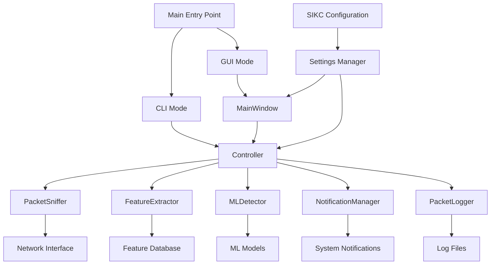

# SCADA-IDS-KC Technical Documentation

**Version:** 1.0.0  
**Date:** July 21, 2025  
**Project:** SCADA-IDS-KC Network Intrusion Detection System

---

## 📋 Table of Contents

1. [System Architecture Overview](#system-architecture-overview)
2. [Core Modules Documentation](#core-modules-documentation)
3. [GUI Components Documentation](#gui-components-documentation)
4. [Configuration System](#configuration-system)
5. [API Reference](#api-reference)
6. [Integration Points](#integration-points)
7. [External Dependencies](#external-dependencies)
8. [Development Guidelines](#development-guidelines)

---

## 🏗️ System Architecture Overview

### High-Level Architecture



### Component Relationships

The SCADA-IDS-KC system follows a modular architecture with clear separation of concerns:

- **Controller Layer**: Central coordination of all components
- **Capture Layer**: Network packet capture and preprocessing
- **Analysis Layer**: Feature extraction and ML-based threat detection
- **Interface Layer**: CLI and GUI interfaces for user interaction
- **Configuration Layer**: Centralized settings management
- **Logging Layer**: Comprehensive audit trails and debugging

### Data Flow

```
Network Traffic → Packet Capture → Feature Extraction → ML Analysis → Threat Detection → Notifications/Logging
```

---

## 🔧 Core Modules Documentation

### 1. Controller Module (`scada_ids/controller.py`)

**Purpose**: Central coordinator that orchestrates packet capture, feature extraction, ML detection, and notifications.

#### Key Classes

##### `IDSController`
**Description**: Thread-safe main application controller with performance monitoring.

**Constructor Parameters**:
- `status_callback` (Optional[Callable]): Callback for status updates

**Key Methods**:

```python
def start(self, interface: str = None) -> bool:
    """Start monitoring on specified network interface."""
    
def stop(self) -> None:
    """Stop monitoring and cleanup resources."""
    
def get_status(self) -> Dict[str, Any]:
    """Get comprehensive system status information."""
    
def get_statistics(self) -> Dict[str, Any]:
    """Get real-time monitoring statistics."""
```

**Thread Safety**: Uses `threading.RLock()` for reentrant locking.

**Performance Features**:
- Packet processing queue with configurable size
- Processing time tracking with sliding window
- Memory usage monitoring
- Error rate tracking with automatic recovery

### 2. Packet Capture Module (`scada_ids/capture.py`)

**Purpose**: Network packet capture using Scapy with thread-safe implementation.

#### Key Classes

##### `PacketSniffer`
**Description**: Thread-safe packet capture with interface management.

**Constructor Parameters**:
- `packet_callback` (Optional[Callable]): Callback for captured packets

**Key Methods**:

```python
def start_capture(self, interface: str = None) -> bool:
    """Start packet capture on specified interface."""
    
def stop_capture(self) -> None:
    """Stop packet capture and cleanup."""
    
def get_interfaces(self) -> List[str]:
    """Get list of available network interfaces."""
    
def get_interfaces_with_names(self) -> List[Dict[str, str]]:
    """Get interfaces with friendly names from Windows registry."""
```

**Features**:
- Automatic interface detection
- BPF filtering support
- Error recovery and rate limiting
- Windows registry integration for friendly interface names

### 3. Machine Learning Module (`scada_ids/ml.py`)

**Purpose**: ML-based threat detection using scikit-learn with security validation.

#### Key Classes

##### `MLDetector`
**Description**: Thread-safe ML detector with input validation and security checks.

**Key Methods**:

```python
def load_models(self, model_path: str = None, scaler_path: str = None) -> bool:
    """Load ML model and scaler from disk."""
    
def predict(self, features: Dict[str, float]) -> Tuple[float, bool]:
    """Make threat prediction from extracted features."""
    
def get_model_info(self) -> Dict[str, Any]:
    """Get detailed model information and statistics."""
    
def is_model_loaded(self) -> bool:
    """Check if ML models are loaded and ready."""
```

**Security Features**:
- Input validation with bounds checking
- Model file size limits (100MB max)
- Hash verification for model integrity
- Protection against adversarial inputs

**Supported Models**:
- RandomForestClassifier (primary)
- DummyClassifier (fallback for testing)

### 4. Feature Extraction Module (`scada_ids/features.py`)

**Purpose**: Extract network features from packets using sliding window counters.

#### Key Classes

##### `FeatureExtractor`
**Description**: Thread-safe feature extraction with memory leak prevention.

**Key Methods**:

```python
def extract_features(self, packet_info: Dict[str, Any]) -> Dict[str, float]:
    """Extract 19 network features from packet information."""
    
def get_feature_names(self) -> List[str]:
    """Get list of feature names in expected order."""
    
def reset_counters(self) -> None:
    """Reset all feature counters and cleanup memory."""
    
def get_statistics(self) -> Dict[str, Any]:
    """Get feature extraction statistics."""
```

**Extracted Features** (19 total):
1. `global_syn_rate` - Global SYN packet rate
2. `global_packet_rate` - Global packet rate
3. `global_byte_rate` - Global byte transfer rate
4. `src_syn_rate` - Source IP SYN rate
5. `src_packet_rate` - Source IP packet rate
6. `src_byte_rate` - Source IP byte rate
7. `dst_syn_rate` - Destination IP SYN rate
8. `dst_packet_rate` - Destination IP packet rate
9. `dst_byte_rate` - Destination IP byte rate
10. `unique_dst_ports` - Unique destination ports count
11. `unique_src_ips_to_dst` - Unique source IPs to destination
12. `packet_size` - Individual packet size
13. `dst_port` - Destination port number
14. `src_port` - Source port number
15. `syn_flag` - SYN flag presence (0/1)
16. `ack_flag` - ACK flag presence (0/1)
17. `fin_flag` - FIN flag presence (0/1)
18. `rst_flag` - RST flag presence (0/1)
19. `syn_packet_ratio` - Ratio of SYN to total packets

### 5. Settings Management Module (`scada_ids/settings.py`)

**Purpose**: Centralized configuration management with SIKC.cfg integration.

#### Key Classes

##### `AppSettings`
**Description**: Main settings container with validation and persistence.

**Key Methods**:

```python
@classmethod
def load_from_yaml(cls, config_path: str = None) -> 'AppSettings':
    """Load settings from YAML configuration file."""
    
def reload_from_sikc(self) -> bool:
    """Reload settings from SIKC.cfg if changed."""
    
def save_to_sikc(self) -> bool:
    """Save current settings to SIKC.cfg."""
    
def get_resource_path(self, resource: str) -> Path:
    """Get path to application resource."""
```

**Configuration Sections**:
- `NetworkSettings`: Interface and capture configuration
- `DetectionSettings`: ML model and threshold configuration
- `NotificationSettings`: Alert and notification configuration
- `LoggingSettings`: Log file and verbosity configuration
- `GUISettings`: Interface and theme configuration

### 6. Packet Logging Module (`scada_ids/packet_logger.py`)

**Purpose**: Comprehensive logging of packet capture and ML analysis events.

#### Key Classes

##### `PacketLogger`
**Description**: JSON-based logging system for audit trails and debugging.

**Key Methods**:

```python
def log_packet_capture(self, packet_info: Dict[str, Any]) -> None:
    """Log packet capture event with metadata."""
    
def log_feature_extraction(self, packet_id: int, packet_info: Dict, 
                          features: Dict, processing_time: float) -> None:
    """Log feature extraction results."""
    
def log_ml_analysis(self, packet_id: int, features: Dict, 
                   ml_result: Dict, processing_time: float) -> None:
    """Log ML analysis results with model details."""
```

**Log Format**: JSON with millisecond timestamps and complete metadata.

### 7. Notification Module (`scada_ids/notifier.py`)

**Purpose**: Cross-platform notification system for security alerts.

#### Key Classes

##### `NotificationManager`
**Description**: Multi-platform notification system with fallback support.

**Supported Platforms**:
- Windows: win10toast (primary), plyer (fallback)
- Linux/macOS: plyer
- System tray: Always available

---

## 🖥️ GUI Components Documentation

### 1. Main Window (`ui/main_window.py`)

**Purpose**: Primary GUI interface with real-time monitoring dashboard.

#### Key Classes

##### `MainWindow(QMainWindow)`
**Description**: Main application window with tabbed interface and system tray integration.

**Key Features**:
- Real-time packet capture statistics
- Threat detection dashboard
- Network interface selection
- ML model management
- System diagnostics
- Configuration management

**Key Methods**:

```python
def _start_monitoring(self) -> None:
    """Start network monitoring with selected interface."""
    
def _stop_monitoring(self) -> None:
    """Stop monitoring and update UI state."""
    
def _update_statistics(self) -> None:
    """Update real-time statistics display."""
    
def _handle_attack_detected(self, attack_info: Dict[str, Any]) -> None:
    """Handle threat detection events."""
```

**UI Components**:
- Header panel with system status
- Tabbed interface (Monitoring, ML Models, Diagnostics)
- Control panel with start/stop buttons
- Real-time statistics dashboard
- Activity log with filtering
- System tray integration

##### `IDSWorkerThread(QThread)`
**Description**: Background thread for IDS operations to keep GUI responsive.

**Signals**:
- `status_update`: System status changes
- `attack_detected`: Security threats detected
- `stats_updated`: Statistics updates

### 2. Configuration Dialog (`ui/config_dialog.py`)

**Purpose**: Comprehensive configuration management interface.

#### Key Classes

##### `ConfigurationDialog(QDialog)`
**Description**: Multi-tab configuration editor for all SIKC.cfg settings.

**Features**:
- Dynamic tab generation from configuration sections
- Input validation and type conversion
- Real-time change tracking
- Import/export functionality
- Backup and restore capabilities

### 3. Theme Management (`ui/themes.py`)

**Purpose**: Application theming and styling system.

#### Key Classes

##### `ThemeManager(QObject)`
**Description**: Manages light and dark themes with persistent preferences.

**Available Themes**:
- Light: Professional light theme with blue accents
- Dark: Modern dark theme with green accents

**Key Methods**:

```python
def apply_theme(self, theme_name: str) -> bool:
    """Apply theme to entire application."""
    
def get_available_themes(self) -> List[str]:
    """Get list of available theme names."""
```

---

## ⚙️ Configuration System

### SIKC Configuration (`SIKC.cfg`)

The system uses a centralized INI-style configuration file with the following sections:

#### `[network]` - Network Configuration
```ini
interface = ""                    # Auto-select if empty
bpf_filter = "tcp and tcp[13]=2"  # SYN packets only
promiscuous_mode = yes
capture_timeout = 1
```

#### `[detection]` - ML Detection Settings
```ini
prob_threshold = 0.05             # Threat detection threshold
window_seconds = 60               # Feature extraction window
model_path = "models/syn_model.joblib"
scaler_path = "models/syn_scaler.joblib"
```

#### `[gui]` - GUI Configuration
```ini
window_title = "SCADA-IDS-KC - Network Intrusion Detection"
default_window_width = 1200
default_window_height = 800
theme = light
enable_system_tray = yes
```

#### `[logging]` - Logging Configuration
```ini
log_level = INFO
log_file = "logs/scada.log"
max_log_size = 10485760          # 10MB
backup_count = 5
```

### Configuration Management Functions

```python
# Get configuration values
from scada_ids.settings import get_sikc_value
threshold = get_sikc_value('detection', 'prob_threshold', 0.05)

# Set configuration values
from scada_ids.settings import set_sikc_value
set_sikc_value('detection', 'prob_threshold', 0.1)

# Reload configuration
from scada_ids.settings import reload_sikc_settings
reload_sikc_settings()
```

---

## 📚 API Reference

### Core API Functions

#### Controller API
```python
from scada_ids.controller import get_controller

controller = get_controller()
controller.start("eth0")          # Start monitoring
stats = controller.get_statistics()  # Get real-time stats
controller.stop()                 # Stop monitoring
```

#### ML Detection API
```python
from scada_ids.ml import get_detector

detector = get_detector()
probability, is_threat = detector.predict(features)
model_info = detector.get_model_info()
```

#### Settings API
```python
from scada_ids.settings import get_settings

settings = get_settings()
threshold = settings.detection.prob_threshold
interfaces = settings.network.interface
```

### CLI Interface

The application provides comprehensive CLI commands:

```bash
# System status and information
./SCADA-IDS-KC.exe --cli --status
./SCADA-IDS-KC.exe --cli --interfaces
./SCADA-IDS-KC.exe --cli --test-ml

# Monitoring operations
./SCADA-IDS-KC.exe --cli --monitor --interface eth0 --duration 60

# Configuration management
./SCADA-IDS-KC.exe --cli --config-get detection prob_threshold
./SCADA-IDS-KC.exe --cli --config-set detection prob_threshold 0.1
```

---

## 🔗 Integration Points

### Component Integration

1. **Controller ↔ GUI**: Status updates and command execution
2. **Controller ↔ PacketSniffer**: Packet capture coordination
3. **Controller ↔ MLDetector**: Feature analysis and threat detection
4. **Settings ↔ All Components**: Configuration propagation
5. **PacketLogger ↔ Controller**: Event logging and audit trails

### External System Integration

- **Network Interfaces**: Direct integration with system network stack
- **File System**: Configuration files, logs, and ML models
- **System Notifications**: Platform-specific notification systems
- **System Tray**: Desktop environment integration

---

## 📦 External Dependencies

### Core Dependencies
- **Python 3.8+**: Runtime environment
- **PyQt6**: GUI framework
- **scapy**: Network packet capture
- **scikit-learn**: Machine learning models
- **joblib**: Model serialization
- **pydantic**: Data validation
- **PyYAML**: Configuration file parsing

### Platform-Specific Dependencies
- **Windows**: Npcap/WinPcap for packet capture
- **Windows**: win10toast for native notifications
- **Cross-platform**: plyer for notifications

### Optional Dependencies
- **numpy**: Numerical computations (auto-detected)
- **pandas**: Data analysis (optional)

---

## 🛠️ Development Guidelines

### Code Style
- Follow PEP 8 Python style guidelines
- Use type hints for all public methods
- Comprehensive docstrings for all classes and methods
- Thread-safety considerations for all shared resources

### Testing
- Unit tests for all core components
- Integration tests for component interactions
- Performance tests for packet processing
- GUI tests for interface functionality

### Security Considerations
- Input validation for all external data
- Bounds checking for ML model inputs
- File size limits for model loading
- Error handling without information disclosure

### Performance Guidelines
- Use threading for I/O operations
- Implement proper resource cleanup
- Monitor memory usage and implement cleanup
- Use efficient data structures for feature extraction

---

## 🔍 Detailed Module Analysis

### Entry Points

#### `main.py` - Primary Application Entry Point
**Purpose**: Main entry point supporting both CLI and GUI modes with comprehensive argument parsing.

**Key Functions**:

```python
def setup_logging(log_level: str = "INFO", log_file: str = None):
    """Setup application logging with JSON configuration support."""

def check_system_requirements():
    """Validate system requirements and dependencies."""

def run_gui_mode():
    """Initialize and run GUI application with PyQt6."""

def run_cli_mode(args):
    """Execute CLI commands with argument parsing."""
```

**Command Line Arguments**:
- `--cli`: Enable CLI mode
- `--status`: Show system status
- `--interfaces`: List network interfaces
- `--monitor`: Start monitoring
- `--test-ml`: Test ML models
- `--config-*`: Configuration management commands

#### System Requirements Checking
The application performs comprehensive system validation:

```python
# Required modules validation
required_modules = [
    'scapy', 'PyQt6', 'sklearn', 'joblib',
    'pydantic', 'yaml', 'numpy', 'pandas'
]

# Platform-specific checks
if sys.platform == "win32":
    # Check for Npcap/WinPcap
    # Validate win10toast availability
```

### Advanced Configuration System

#### `scada_ids/sikc_config.py` - SIKC Configuration Manager
**Purpose**: Advanced configuration management with validation, backup, and schema support.

**Key Classes**:

##### `SIKCConfig`
**Description**: Comprehensive configuration manager with validation and backup capabilities.

**Key Methods**:

```python
def get(self, section: str, option: str, fallback=None) -> Any:
    """Get configuration value with type conversion and fallback."""

def set(self, section: str, option: str, value: Any) -> bool:
    """Set configuration value with validation."""

def create_backup(self, backup_name: str) -> bool:
    """Create named configuration backup."""

def restore_backup(self, backup_name: str) -> bool:
    """Restore configuration from backup."""

def get_validation_errors(self) -> List[str]:
    """Validate configuration against schema."""
```

**Configuration Schema**:
The system includes comprehensive validation schemas for all configuration sections:

```python
CONFIGURATION_SCHEMA = {
    "network": {
        "interface": {"type": str, "default": ""},
        "bpf_filter": {"type": str, "default": "tcp and tcp[13]=2"},
        "promiscuous_mode": {"type": bool, "default": True},
        "capture_timeout": {"type": int, "min": 1, "max": 60, "default": 1}
    },
    "detection": {
        "prob_threshold": {"type": float, "min": 0.0, "max": 1.0, "default": 0.05},
        "window_seconds": {"type": int, "min": 10, "max": 3600, "default": 60}
    }
}
```

### Security and Performance Modules

#### `scada_ids/security.py` - Security Validation
**Purpose**: Security checks and input validation for the IDS system.

**Key Functions**:

```python
def validate_network_interface(interface: str) -> bool:
    """Validate network interface name for security."""

def sanitize_log_input(log_data: str) -> str:
    """Sanitize log input to prevent injection attacks."""

def check_file_permissions(file_path: str) -> bool:
    """Verify file permissions for security."""
```

#### `scada_ids/performance.py` - Performance Monitoring
**Purpose**: System performance monitoring and optimization.

**Key Classes**:

##### `PerformanceMonitor`
**Description**: Real-time performance monitoring with metrics collection.

**Monitored Metrics**:
- CPU usage per component
- Memory consumption tracking
- Packet processing latency
- Queue sizes and throughput
- Error rates and recovery times

### System Checker Module

#### `scada_ids/system_checker.py` - System Requirements Validation
**Purpose**: Comprehensive system requirements checking for GUI and CLI modes.

**Key Functions**:

```python
def check_system_requirements() -> Tuple[bool, Dict[str, Any], List[str]]:
    """
    Comprehensive system requirements check.

    Returns:
        Tuple of (is_ready, status_dict, missing_requirements)
    """

def check_network_capabilities() -> Dict[str, bool]:
    """Check network capture capabilities."""

def check_ml_dependencies() -> Dict[str, bool]:
    """Validate ML library availability and versions."""
```

### Configuration Validator

#### `scada_ids/config_validator.py` - Configuration Validation
**Purpose**: Advanced configuration validation with schema enforcement.

**Key Classes**:

##### `ConfigValidator`
**Description**: Schema-based configuration validation with detailed error reporting.

**Validation Features**:
- Type checking and conversion
- Range validation for numeric values
- Pattern matching for string values
- Cross-field validation
- Custom validation rules

---

## 🎨 Advanced GUI Components

### Enhanced UI Components

#### `ui/requirements_dialog.py` - System Requirements Dialog
**Purpose**: Interactive dialog for handling missing system requirements.

**Features**:
- Detailed requirement status display
- Installation guidance for missing components
- Option to continue with limited functionality
- Platform-specific installation instructions

#### `ui/splash_screen.py` - Application Splash Screen
**Purpose**: Professional startup screen with progress indication.

**Features**:
- Logo display with fallback rendering
- Progress message updates
- Auto-close timer (3 seconds)
- Smooth transition to main window

### Theme System Details

#### Advanced Theming Features
The theme system provides comprehensive styling:

**Light Theme Characteristics**:
- Clean white background (#ffffff)
- Blue accent colors (#0078d4)
- Professional appearance for corporate environments
- High contrast for accessibility

**Dark Theme Characteristics**:
- Dark background (#1e1e1e)
- Green accent colors (#00ff88)
- Reduced eye strain for extended use
- Modern cybersecurity aesthetic

**Theme Components**:
- Window backgrounds and borders
- Button styles and hover effects
- Text colors and selection highlights
- Progress bars and status indicators
- Menu and toolbar styling

---

## 📊 Data Structures and Protocols

### Packet Information Structure

```python
PacketInfo = {
    'timestamp': float,           # Unix timestamp
    'src_ip': str,               # Source IP address
    'dst_ip': str,               # Destination IP address
    'src_port': int,             # Source port number
    'dst_port': int,             # Destination port number
    'packet_size': int,          # Packet size in bytes
    'flags': int,                # TCP flags as integer
    'protocol': str,             # Protocol name (TCP/UDP/ICMP)
    'capture_interface': str     # Interface where packet was captured
}
```

### ML Analysis Result Structure

```python
MLResult = {
    'model_type': str,           # Model class name
    'probability': float,        # Threat probability (0.0-1.0)
    'is_threat': bool,          # Boolean threat decision
    'threshold': float,          # Detection threshold used
    'confidence': float,         # Prediction confidence
    'processing_time_ms': float, # ML processing time
    'feature_count': int,        # Number of features processed
    'model_details': {           # Detailed model information
        'prediction_count': int,
        'error_count': int,
        'classes': List[int],
        'feature_scaling_applied': bool
    }
}
```

### Statistics Structure

```python
SystemStatistics = {
    'packets_captured': int,     # Total packets processed
    'threats_detected': int,     # Number of threats found
    'alerts_sent': int,         # Notifications sent
    'start_time': str,          # Session start timestamp
    'uptime_seconds': float,    # Session duration
    'processing_rate': float,   # Packets per second
    'memory_usage_mb': float,   # Current memory usage
    'cpu_usage_percent': float, # CPU utilization
    'error_count': int,         # Total errors encountered
    'last_packet_time': str     # Last packet timestamp
}
```

---

## 🔧 Advanced Integration Patterns

### Observer Pattern Implementation

The system uses the Observer pattern for component communication:

```python
# Status update notifications
class StatusObserver:
    def on_status_change(self, status: Dict[str, Any]) -> None:
        """Handle status change notifications."""
        pass

# Attack detection notifications
class AttackObserver:
    def on_attack_detected(self, attack_info: Dict[str, Any]) -> None:
        """Handle attack detection events."""
        pass
```

### Thread-Safe Communication

All inter-component communication uses thread-safe mechanisms:

- **Queue-based messaging**: For packet processing pipeline
- **Signal/slot pattern**: For GUI updates (PyQt6)
- **Lock-protected shared state**: For statistics and configuration
- **Weak references**: For automatic cleanup

### Error Handling Strategy

The system implements comprehensive error handling:

1. **Graceful Degradation**: Continue operation with reduced functionality
2. **Automatic Recovery**: Retry failed operations with exponential backoff
3. **Error Isolation**: Prevent errors in one component from affecting others
4. **Detailed Logging**: Comprehensive error information for debugging

---

## 🚀 Performance Optimization

### Packet Processing Pipeline

The packet processing pipeline is optimized for high throughput:

```python
# Optimized processing flow
Network Interface → Capture Queue → Feature Extraction → ML Analysis → Logging
     ↓                ↓                    ↓                ↓           ↓
Thread Pool      Ring Buffer      Vectorized Ops    Batch Predict   Async I/O
```

### Memory Management

- **Sliding Window Counters**: Automatic cleanup of old data
- **Weak References**: Prevent circular references
- **Resource Pools**: Reuse expensive objects
- **Garbage Collection**: Explicit cleanup in critical paths

### Caching Strategies

- **Model Caching**: Keep loaded ML models in memory
- **Interface Caching**: Cache network interface information
- **Configuration Caching**: Avoid repeated file I/O
- **Feature Caching**: Reuse computed features when possible

---

## 🧪 Testing Framework

### Test Categories

1. **Unit Tests**: Individual component testing
2. **Integration Tests**: Component interaction testing
3. **Performance Tests**: Throughput and latency testing
4. **GUI Tests**: User interface functionality testing
5. **Security Tests**: Input validation and security testing

### Test Utilities

```python
# Mock packet generator for testing
def generate_test_packets(count: int, attack_ratio: float) -> List[Dict]:
    """Generate synthetic packets for testing."""

# Performance measurement utilities
def measure_processing_time(func: Callable) -> Tuple[Any, float]:
    """Measure function execution time."""

# GUI testing helpers
def simulate_user_interaction(widget: QWidget, action: str) -> None:
    """Simulate user interactions for GUI testing."""
```

---

## 📈 Monitoring and Diagnostics

### Built-in Diagnostics

The system includes comprehensive diagnostic capabilities:

- **Real-time Performance Metrics**: CPU, memory, and throughput monitoring
- **Component Health Checks**: Automatic validation of all components
- **Network Interface Status**: Interface availability and statistics
- **ML Model Validation**: Model integrity and performance checks
- **Configuration Validation**: Settings verification and error detection

### Logging Levels

```python
LOGGING_LEVELS = {
    'DEBUG': 'Detailed debugging information',
    'INFO': 'General operational information',
    'WARNING': 'Warning messages for potential issues',
    'ERROR': 'Error conditions that need attention',
    'CRITICAL': 'Critical errors requiring immediate action'
}
```

### Audit Trail

All system activities are logged for security auditing:

- **User Actions**: All GUI and CLI operations
- **Configuration Changes**: Settings modifications with timestamps
- **Security Events**: Threat detections and system alerts
- **System Events**: Startup, shutdown, and error conditions
- **Performance Events**: Performance degradation and recovery

---

**For implementation details and code examples, refer to the source code in the `src/` directory and the comprehensive test suite in `tests/`.**
